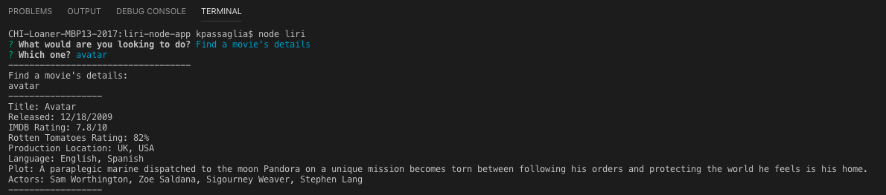
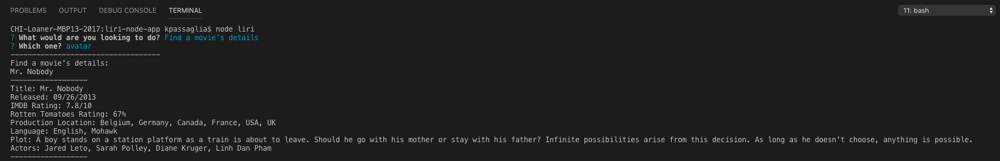

# liri-node-app
node app assignment

Submission Needs- 
Gif
Video

Additions:
Used Inquirer prompt instead of process.argv commands to ensure there are not syntax errors....also its alot faster then typing out the full command each time.  Also, wanted to increase the user expereince a bit so I switched the commands to the following:

concert-this ==> Find a band's upcoming shows
spotify-this-song  ==>  Find a song's details
movie-this / Find  ==>  movie's details
do-what-it-says  ==>  Find out something new

Inquirer prompt in console

Bandsintown API via axios response in console

Spotify API re

OMDB API via axios response in console (avatar)

OMDB API via axios response in console (no Input)

